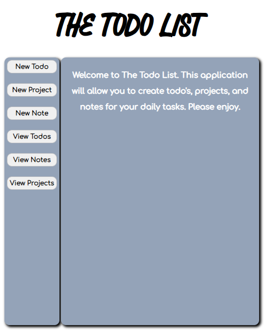
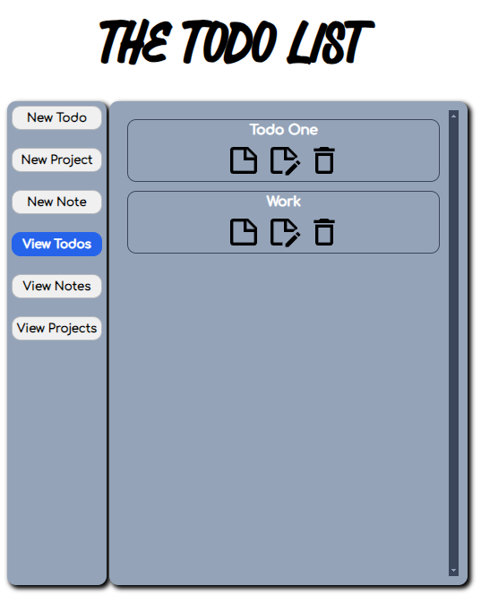

# The Todo List

## Assignment: 
1. The todo's should be objects that you'll want to dynamically create, which means either using factories or 
constructors/classes to generate them.

2. Brainstorm what of properties the todo-items are going to have. They should have a title, description, dueDate, and 
priority. You might also want to include notes or even a checklist.

3. The todo list should have projects or a separate lists of todos. When a user first opens the app, there should 
be some sort of default project to which all of their todos are put. Users should be able to create new projects 
and choose which project their todos go into.

4. Application logic and DOM related stuff should be separated.

5. User interface is up to the developer. 

6. The localStorage method should be used, so that when the user closes the browser the information will remain in storage 
when the browser is reopened. 

## Description:
The user will be able to create new todo's, notes, and projects. Each property will have their own display screen where the user
can view the information they've entered. The information for todo's and project todo's can be viewed, edited, and deleted. Notes
can also be viewed and deleted. The local storage will save all the todo's, projects, and notes when the browser is closed. 

## Live Demo:
[The Todo List](https://ibn12.github.io/odin-todo-list/) 